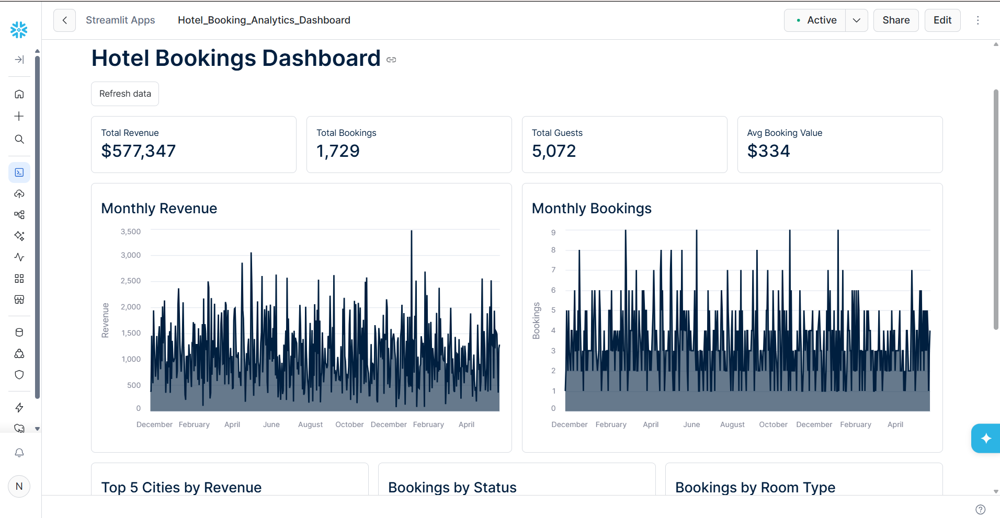
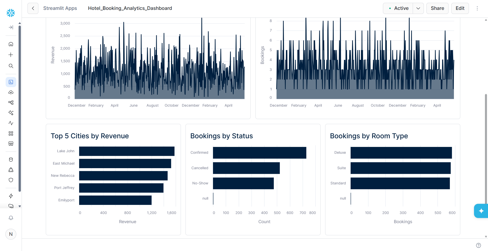

# Hotel Booking Analysis Dashboard Using Snowflake

An end-to-end hotel bookings data pipeline built using **Snowflake, SQL, Python, and Streamlit**.

## 🔄 Data Pipeline

**CSV → Bronze → Data Quality Checks → Silver → Gold → Streamlit Dashboard**

### 🥉 Bronze Layer — Raw/Staging

* Imported the hotel bookings CSV into Snowflake.
* Created a Snowflake stage and CSV file format.
* Loaded the raw data into `BRONZE_HOTEL_BOOKING`.
* Used the Bronze layer as the staging area for initial data validation.

### 🔍 Data Quality Checks

* Checked for missing and invalid customer email addresses.
* Identified negative booking amounts.
* Checked for invalid check-in/check-out date combinations.
* Reviewed distinct booking-status values for inconsistencies.

### 🥈 Silver Layer — Cleaned Data

* Standardized hotel city and customer names using trimming and capitalization.
* Cleaned and standardized customer email addresses.
* Converted check-in and check-out fields from strings to `DATE`.
* Converted guest count and booking amount to appropriate numeric data types.
* Corrected inconsistent booking statuses such as `confirmeeed` and `confirmd` to `Confirmed`.
* Converted negative booking amounts to positive values.
* Filtered out records with invalid dates and invalid booking periods.
* Stored the cleaned data in `SILVER_HOTEL_BOOKINGS`.

### 🥇 Gold Layer — Analytics

Created analytics-ready tables from the Silver layer:

* `GOLD_BOOKING_CLEAN` — clean booking-level dataset.
* `GOLD_AGG_DAILY_BOOKING` — daily booking count and revenue.
* `GOLD_AGG_HOTEL_CITY_SALES` — revenue aggregated by hotel city.

### 📊 Analytics Dashboard

* Built an interactive dashboard connected Snowflake to Streamlit.
* Created KPIs for:

  * Total Revenue
  * Total Bookings
  * Total Guests
  * Average Booking Value
* Added visualizations for:

  * Revenue trends
  * Booking trends
  * Top 5 cities by revenue
  * Bookings by status
  * Bookings by room type
* Used Altair for data visualization.

## 🚀 Live Dashboard

The Streamlit dashboard is deployed on Snowflake and can be accessed here:

👉 [View Live Hotel Booking Dashboard](https://app.snowflake.com/streamlit/awqhzve/xa35323/#/apps/qgl7e5rlxywzgsojvjx6)

> **Note:** Access to the dashboard may require authentication depending on the Snowflake deployment and sharing settings.
